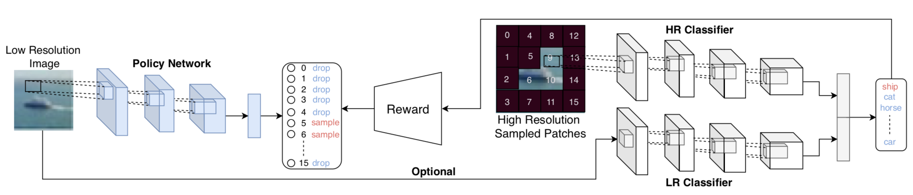
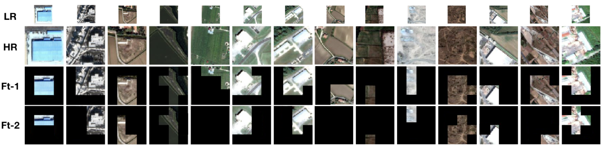

# PatchDrop - Learning When and Where to Zoom With Deep Reinforcement Learning


This repository contains implementation of our CVPR 2020 paper titled as __Learning When and Where to Zoom With Deep Reinforcement Learning__. PatchDrop proposes a reinforcement learning setup to perform conditional image sampling for the image recognition task. The goal is to use less number of image pixels when there is less ambiguity. Our experiments on the benchmarks, including CIFAR10, CIFAR100, ImageNet, and fMoW, we show that we can drop about 50% of the image patches with a minimal loss in classification accuracy. For more details, please check out the arxiv version of the paper [here](https://arxiv.org/pdf/2003.00425.pdf).

## Requirements
**Frameworks**: Our implementation uses **Python3.5** and **PyTorch-v1.4.0** framework.

**Packages**: You should install prerequisites using `pip install -r requirements.txt`

**Datasets**:

  **CIFAR10** and **CIFAR 100**: We use PyTorchAPI to download the CIFAR10 and CIFAR100 datasets.

  **ImageNet**: To run it on ImageNet, you need to follow the guidelines [here](https://github.com/soumith/imagenet-multiGPU.torch#data-processing). You should copy the ImageNet images into the './data/ImageNet/train' and './data/ImageNet/test' folders.

  **fMoW**: You can find the instructions to download images [here](https://github.com/fMoW/dataset). After downloading the images, you need to crop the images from the large satellite images based on the bounding boxes provided in the '.json' files. The original fMoW paper adaptively determines the context and add it to the bounding box to find the final area of interest. We follow their strategy to preprocess the images. After preprocessing images, you need to create a **csv** file with two columns:**(1) label, (2) location**. Label represents the class ID of the image and Location represents the location of the corresponding image. You need to create another .csv file for the validation and test sets. After creating the csv files, transfer them to the directory __./data/fMoW/train.csv__ and __./data/fMoW/test.csv__.

## Training
**Train the High and Low Resolution Classifiers**

In the first step, the high and low resolution classifiers need to be trained on high and low resolution images. To do so, please use the following commands.

To train a classifier on different benchmarks including **C10**, **C100**, **ImageNet** and **fMoW** dataset:

    python classifier_training.py
       --model R32_C10, R32_C100, R34_fMoW, R50_ImgNet
       --lr 1e-1, 1e-1, 1e-3, 1e-3
       --cv_dir checkpoint directory
       --batch_size 128
       --img_size 32, 32, 224, 224 or 8, 8, 56, 56
       --mode hr or lr

**Pre-train the Policy Network**

In the second step, the policy network is trained using our reinforcement learning setup and high resolution classifier's predictions. To do so, please use the following commands.

To train a policy network (pre-training step):

    python pretrain.py
       --model R32_C10, R32_C100, R34_fMoW, R50_ImgNet
       --lr 1e-4, 1e-4, 1e-4, 1e-4
       --cv_dir checkpoint directory
       --batch_size 1024 (higher batch size is better to reduce variance)
       --penalty -0.5, -0.5, -0.5, -0.5

**Fine-tune the Policy Network and High Resolution Classifier**

In this step, we fine-tune the Policy Network and High Resolution Classifier jointly. To do so, please use the following command.

To fine-tune a policy network and HR classifier:

    python finetune.py
       --model R32_C10, R32_C100, R34_fMoW, R50_ImgNet
       --lr 1e-4, 1e-4, 1e-4, 1e-4
       --cv_dir checkpoint directory
       --batch_size 128
       --Load Load from the latest Policy Network checkpoint in the pre-training step
       --ckpt_hr_cl Load from the latest High Resolution Classifier checkpoint
       --penalty -10, -10, -20, -20

**Fine-tune the Policy Network using Two Stream Classifier (Optional)**

This step helps the policy network to drop further patches given the existence of low resolution classifier.

To fine-tune a policy network and HR classifier:

    python finetune2stream.py
       --model R32_C10, R32_C100, R34_fMoW, R50_ImgNet
       --lr 1e-4, 1e-4, 1e-4, 1e-4
       --cv_dir checkpoint directory
       --batch_size 128
       --load Load from the latest checkpoint (Policy Network+hr_classifier)
       --ckpt_lr_cl Load from the latest checkpoint (lr_classifier)
       --penalty -10, -10, -20, -20

## Visualizing Learned Policies on ImageNet and fMoW
We show some of the learned policies below.

**ImageNet**


**fMoW**



For questions or comments, please send an e-mail to **uzkent.burak@gmail.com** or use the issue tab in github.

You can cite our paper as:
```
@article{uzkent2020learning,
  title={Learning When and Where to Zoom with Deep Reinforcement Learning},
  author={Uzkent, Burak and Ermon, Stefano},
  journal={arXiv preprint arXiv:2003.00425},
  year={2020}
}
```
