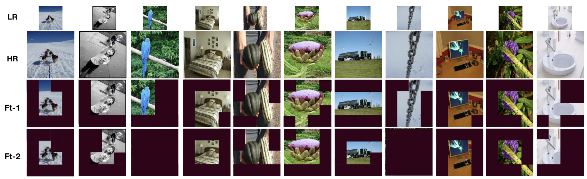

# PatchDrop - Learning When and Where to Zoom With Deep Reinforcement Learning


This repository contains implementation of our CVPR 2020 paper titled as 'Learning When and Where to Zoom With Deep Reinforcement Learning'. You can find the arxiv version of the paper [here](https://arxiv.org/pdf/2003.00425.pdf). PatchDrop proposes a reinforcement learning setup to perform conditional image sampling for the image recognition task. Below, you can find the instructions for training it. Our implementation uses Python3.5 and PyTorch framework.

To be able to train on the **fMoW** dataset, you need to download images. You can find the instructions [here](https://github.com/fMoW/dataset). After downloading the images, you need to crop the images from the large satellite images based on the bounding boxes provided in the '.json' files. The original fMoW paper adaptively determines the context and add it to the bounding box to find the final area of interest. We follow their strategy to preprocess the images. After preprocessing images, you need to create a **csv** file with two columns:**(1) label, (2) location**. Label represents the class ID of the image and Location represents the location of the corresponding image. You need to create another .csv file for the validation and test sets. After creating the csv files, transfer them to the directory __./data/fMoW/train.csv__ and __./data/fMoW/test.csv__.

On the other hand, our implementation uses TorchAPI to download CIFAR10, CIFAR100 images. To run it on **ImageNet**, you need to follow the guidelines [here](https://github.com/soumith/imagenet-multiGPU.torch#data-processing). You should copy the ImageNet images into the './data/ImageNet/train' and './data/ImageNet/test' folders. Some of the results on ImageNet can be found below.



## Train the High and Low Resolution Classifiers
In the first step, the high and low resolution classifiers need to be trained on high or low resolution images. To do so, please use the following commands.

How to train a classifier on different benchmarks including **fMoW**, **C10**, **C100**, and **ImageNet** Dataset:

    python classifier_training.py
       --model R32_C10, R32_C100, R34_fMoW, R50_ImgNet
       --lr 1e-1, 1e-1, 1e-3, 1e-3
       --cv_dir checkpoint directory
       --batch_size 128
       --img_size 32, 32, 224, 224 or 8, 8, 56, 56
       --mode hr or lr

## Pretrain the Policy Network - Agent
In the second step, the policy network is trained using our reinforcement learning setup and high resolution classifier's predictions. To do so, please use the following commands.

How to train a policy network (pre-training step):

    python pretrain.py
       --model R32_C10, R32_C100, R34_fMoW, R50_ImgNet
       --lr 1e-4, 1e-4, 1e-4, 1e-4
       --cv_dir checkpoint directory
       --batch_size 1024 (higher batch size is better to reduce variance)
       --penalty -0.5, -0.5, -0.5, -0.5

## Finetune the Policy Network and High Resolution Classifier
In this step, we finetune the Policy Network and High Resolution Classifier jointly. To do so, please use the following command.

How to finetune a policy network and HR classifier:

    python finetune.py
       --model R32_C10, R32_C100, R34_fMoW, R50_ImgNet
       --lr 1e-4, 1e-4, 1e-4, 1e-4
       --cv_dir checkpoint directory
       --batch_size 128
       --Load Load from the latest Policy Network checkpoint in the pretraining step
       --ckpt_hr_cl Load from the latest High Resolution Classifier checkpoint
       --penalty -10, -10, -20, -20

## Finetune the Policy Network using Two Stream Classifier (Optional)
This step helps the policy network to drop further patches given the existence of low resolution classifier.

How to finetune a policy network and HR classifier:

    python finetune2stream.py
       --model R32_C10, R32_C100, R34_fMoW, R50_ImgNet
       --lr 1e-4, 1e-4, 1e-4, 1e-4
       --cv_dir checkpoint directory
       --batch_size 128
       --load Load from the latest checkpoint (Policy Network+hr_classifier)
       --ckpt_lr_cl Load from the latest checkpoint (lr_classifier)
       --penalty -10, -10, -20, -20

For questions or comments, please send an e-mail to **uzkent.burak@gmail.com** or use the issue tab in github.

You can cite our paper as:
```
@article{uzkent2020learning,
  title={Learning When and Where to Zoom with Deep Reinforcement Learning},
  author={Uzkent, Burak and Ermon, Stefano},
  journal={arXiv preprint arXiv:2003.00425},
  year={2020}
}
```
